<!-- =======================================================================
     GitHub profile README for @twgnr
     Lives in a PUBLIC repo named exactly "twgnr" (README.md at the root).
     GitHub then renders this on https://github.com/twgnr
     ======================================================================= -->


 

  

---

### Two worlds, one keyboard.

I build software across the whole spectrum — from **enterprise Oracle systems** that quietly run a business, to **real-time audio plugins** where every microsecond counts, to **self-hosted web apps** I actually use every day.

By day: software engineer and Oracle database specialist. By night the same keyboard controls synthesizers — I write DSP in **C++**, produce EDM as **L0wFl0w**, and build the tools I wish existed.

---

### What I build it with.

  

---

### Things I build.

**At work** — my day job is internal, closed source software, so this stays general. These two are only a small part of it, but they're my favorites:

- **Orchestrator** — Architect and lead developer of an in-house automation platform: a scheduler that keeps recurring data jobs running around the clock, runs them in parallel, handles failures with retries and back-off, and reports centrally on what ran and what did not.
- **API** — Part of the team behind our central internal API — building it out and integrating the surrounding systems against it.

**Open source** — public repositories, dig in:

| | Project | What it is |
| :-- | :-- | :-- |
| <a href="assets/projects-full/sshit-commander.png">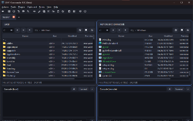</a> | **[SSHIT-Commander](https://github.com/twgnr/SSHIT-Commander2)** `Beta` | Dual-pane SSH/SFTP file manager with a real terminal (ConPTY locally, PTY over SSH). `C++20` · `Qt 6` · `libssh2` |
| <a href="assets/projects-full/web-vulnerability-scanner.png">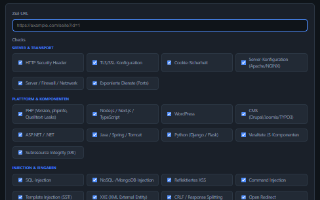</a> | **[Web Vulnerability Scanner](https://github.com/twgnr/web-vulnerability-scanner)** | Non-destructive scanner for **authorized** security testing — strictly defensive by design. `Python` · `Flask` |
| <a href="assets/projects-full/ai-stock-analyzer.png">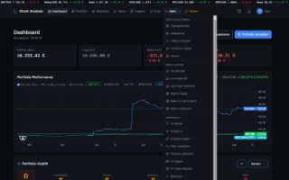</a> | **[AI Stock Analyzer](https://github.com/twgnr/ai-stock-analyzer)** | Self-hosted, AI-assisted equity research & portfolio PWA with a multi-provider LLM backend. `Next.js` · `React` · `MongoDB` |
| 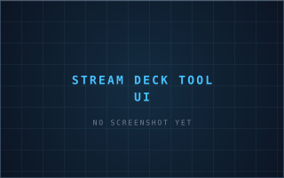 | **[Stream Deck Tool UI](https://github.com/twgnr/Stream-Deck-Tool-UI)** | Open-source config tool for Elgato Stream Deck — dynamic keys, live metrics, macros. `Python` · `Tkinter` |

**Private highlights** — closed source, but this is what they are:

| | Project | What it is |
| :-- | :-- | :-- |
| <a href="assets/projects-full/wavesix.png">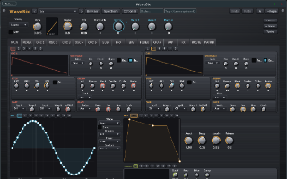</a> | **WaveSix** `active dev` | 6-oscillator wavetable synthesizer — Serum-format import, per-voice 16-slot mod matrix, band-limited wavetables. VST3 & standalone. `C++17` · `JUCE 8` · `VST3` |
| <a href="assets/projects-full/beyond-dj.png">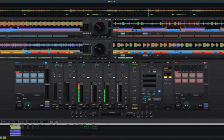</a> | **Beyond DJ** | Four-deck DJ system: club-style mixer, beatgrid sync, phase-vocoder keylock, Automix and a click-free custom playback engine. `C++` · `JUCE` · `DSP` |
| <a href="assets/projects-full/beyond-voice.png">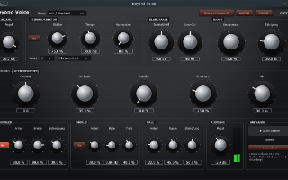</a> | **Beyond Voice** | Vocal channel strip: scale-aware pitch correction, harmonizer, formant shifting and a note editor for after-the-fact correction. `C++` · `JUCE` · `DSP` |
| <a href="assets/projects-full/beyond-drums.png">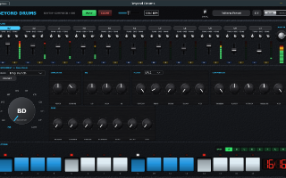</a> | **Beyond Drums** | TR-808-style rhythm composer — eleven fully synthesized instruments, no samples, with a channel strip each and a step sequencer. `C++` · `JUCE` · `Synthesis` |
| <a href="assets/projects-full/beyond-guitar.png">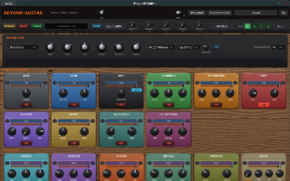</a> | **Beyond Guitar** | Amp and effects simulation: tube-stage modelling with oversampling, cabinet IRs with mic positioning, drag-and-drop effect chain. `C++` · `JUCE` · `Amp Modelling` |
| <a href="assets/projects-full/beyond-loops.png">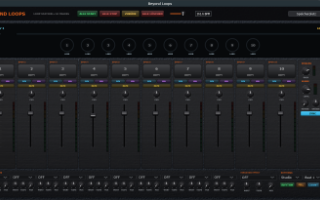</a> | **Beyond Loops** | Ten-track loop station with overdub, shared undo and phase-locked sync — memory fully pre-allocated so the audio thread never allocates. `C++` · `JUCE` |
| <a href="assets/projects-full/pwd-manager.png">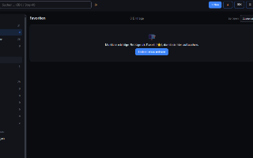</a> | **Password Manager** | Zero-knowledge vault across web, desktop & mobile — Argon2id, per-entry AES-256-GCM, passkeys (WebAuthn); the server only ever sees ciphertext. `Node.js` · `Electron` · `Capacitor` |
| <a href="assets/projects-full/netfett.png">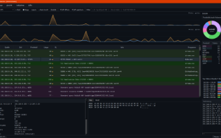</a> | **NetFett** | Network monitor and protocol analyzer in pure Python — raw sockets, no Npcap, and a dissector stack with zero third-party dependencies. `Python` · `PySide6` |
| <a href="assets/projects-full/buck-o-mo.png">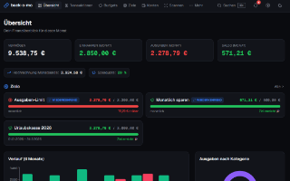</a> | **Buck-O-Mo** | Budget app that reads receipts and invoices — OCR runs **on-device**, only the extracted figures ever reach the database. `Next.js` · `React` · `MongoDB` |

---

### By the numbers.


