<!-- =======================================================================
     GitHub profile README for @twgnr
     Lives in a PUBLIC repo named exactly "twgnr" (README.md at the root).
     GitHub then renders this on https://github.com/twgnr
     ======================================================================= -->



 

  

---

### Two worlds, one keyboard.

I build software across the whole spectrum — from **enterprise Oracle systems** that quietly run a business, to **real-time audio plugins** where every microsecond counts, to **self-hosted web apps** I actually use every day.

By day: software engineer and Oracle database specialist. By night the same keyboard controls synthesizers — I write DSP in **C++**, produce EDM as **L0wFl0w**, and build the tools I wish existed.

---

### What I build it with.

  

---

### Things I build.

**At work** — my day job is internal, closed source software, so this stays general. These two are only a small part of it, but they're my favorites:

- **Orchestrator** — Architect and lead developer of an in-house automation platform: a scheduler that keeps recurring data jobs running around the clock, runs them in parallel, handles failures with retries and back-off, and reports centrally on what ran and what did not.
- **API** — Part of the team behind our central internal and public API — building it out and integrating the surrounding systems against it.

**Open source** — public repositories, dig in:

| | Project | What it is |
| :-- | :-- | :-- |
| <a href="assets/projects-full/chainer.png">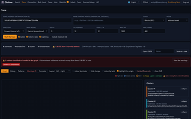</a> | **[Chainer](https://github.com/twgnr/Chainer)** | Crypto tracing across eight chains from **free** data sources — taint analysis (Haircut/FIFO/Poison), wallet clustering, sanctions and abuse lists, checksummed evidence log. Web app **and** a dependency-free native Windows client. `Next.js` · `React` · `C++17` · `Win32` |
| <a href="assets/projects-full/sshit-commander.png">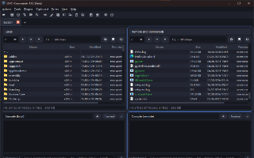</a> | **[SSHIT-Commander](https://github.com/twgnr/SSHIT-Commander2)** `Beta` | Dual-pane SSH/SFTP file manager with a real terminal (ConPTY locally, PTY over SSH). `C++20` · `Qt 6` · `libssh2` |
| <a href="assets/projects-full/web-vulnerability-scanner.png">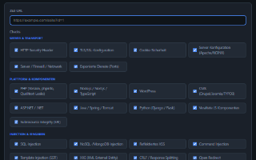</a> | **[Web Vulnerability Scanner](https://github.com/twgnr/web-vulnerability-scanner)** | Non-destructive scanner for **authorized** security testing — strictly defensive by design. `Python` · `Flask` |
| <a href="assets/projects-full/ai-stock-analyzer.png">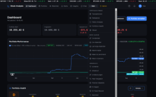</a> | **[AI Stock Analyzer](https://github.com/twgnr/ai-stock-analyzer)** | Self-hosted, AI-assisted equity research & portfolio PWA with a multi-provider LLM backend. `Next.js` · `React` · `MongoDB` |
| 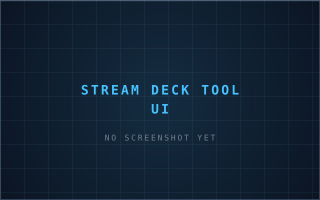 | **[Stream Deck Tool UI](https://github.com/twgnr/Stream-Deck-Tool-UI)** | Open-source config tool for Elgato Stream Deck — dynamic keys, live metrics, macros. `Python` · `Tkinter` |
| <a href="assets/projects-full/netfett.png">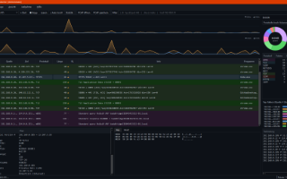</a> | **[NetFett](https://github.com/twgnr/NetFett)** | Network monitor and protocol analyzer in pure Python — raw sockets, no Npcap, and a dissector stack with zero third-party dependencies. `Python` · `PySide6` |

**Private highlights** — closed source, but this is what they are:

| | Project | What it is |
| :-- | :-- | :-- |
| <a href="assets/projects-full/wavesix.png">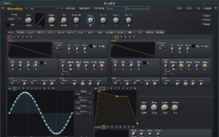</a> | **WaveSix** `active dev` | 6-oscillator wavetable synthesizer — Serum-format import, per-voice 16-slot mod matrix, band-limited wavetables. VST3 & standalone. `C++17` · `JUCE 8` · `VST3` |
| <a href="assets/projects-full/dj.png">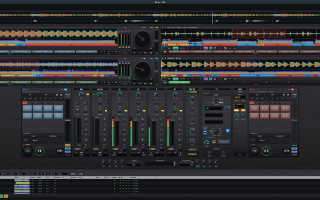</a> | **DJ** | Four-deck DJ system: club-style mixer, beatgrid sync, phase-vocoder keylock, Automix and a click-free custom playback engine. `C++` · `JUCE` · `DSP` |
| <a href="assets/projects-full/voice.png">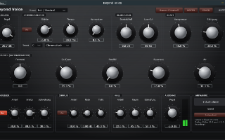</a> | **Voice** | Vocal channel strip: scale-aware pitch correction, harmonizer, formant shifting and a note editor for after-the-fact correction. `C++` · `JUCE` · `DSP` |
| <a href="assets/projects-full/drums.png">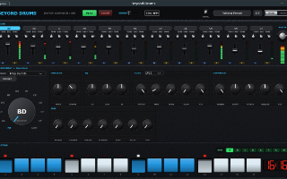</a> | **Drums** | TR-808-style rhythm composer — eleven fully synthesized instruments, no samples, with a channel strip each and a step sequencer. `C++` · `JUCE` · `Synthesis` |
| <a href="assets/projects-full/guitar.png">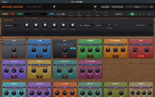</a> | **Guitar** | Amp and effects simulation: tube-stage modelling with oversampling, cabinet IRs with mic positioning, drag-and-drop effect chain. `C++` · `JUCE` · `Amp Modelling` |
| <a href="assets/projects-full/loops.png">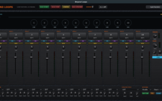</a> | **Loops** | Ten-track loop station with overdub, shared undo and phase-locked sync — memory fully pre-allocated so the audio thread never allocates. `C++` · `JUCE` |
| <a href="assets/projects-full/pwd-manager.png">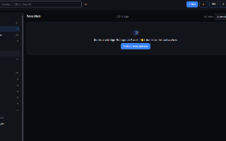</a> | **Password** | Zero-knowledge vault across web, desktop & mobile — Argon2id, per-entry AES-256-GCM, passkeys (WebAuthn); the server only ever sees ciphertext. `Next.js` · `Node.js` · `Electron` · `Capacitor` |
| <a href="assets/projects-full/buck-o-mo.png">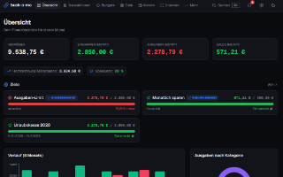</a> | **Buck-O-Mo** | Budget app that reads receipts and invoices — OCR runs **on-device**, only the extracted figures ever reach the database. `Next.js` · `React` · `MongoDB` |
| 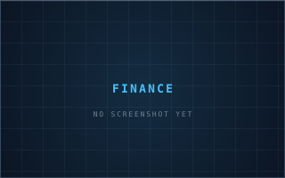 | **Finance** | Accounting that books itself — a self-hosted business suite for small firms. Real double-entry on SKR03/SKR04 (or cash-basis EÜR), quotes through dunning, EN 16931 e-invoicing, FinTS bank sync, time tracking, and a DATEV batch the tax advisor imports directly. `Next.js` · `React` · `MongoDB` |
| <a href="assets/projects-full/boards.png">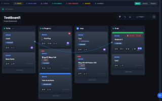</a> | **Boards** | Multi-tenant Kanban platform — a database per tenant, encrypted storage, white-labeling and a customizable board UI. Self-hosted and running in production. `Next.js` · `Express` · `MongoDB` |
| 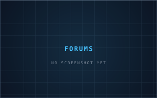 | **Forums** | Sister product to Boards: multi-tenant forum hosting with encryption at rest, spam detection, audit logs and automated moderation tooling. `Next.js` · `Express` · `MongoDB` |
| <a href="assets/projects-full/shopping.png">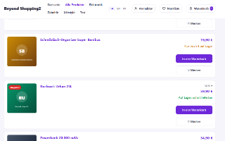</a> | **Shopping** | Multi-tenant e-commerce SaaS, deployed per customer — trilingual storefront, product variants, coupons, reviews, Stripe/Mollie/PayPal checkout, and a fully theme-able design panel with no code required. `Next.js` · `React` · `MongoDB` |
| <a href="assets/projects-full/viewler.png">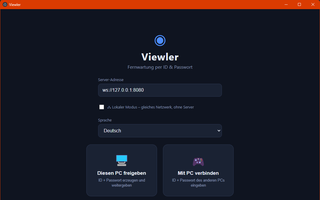</a> | **Viewler** | Lightweight remote support, TeamViewer-style but always consensual. Screen and input travel P2P over WebRTC, so the signaling server never sees the picture. SRP-authenticated sessions, optional TOTP, password rotation, unattended access and a LAN mode that needs no server at all. `Electron` · `WebRTC` · `Node.js` |
| <a href="assets/projects-full/chatter.png">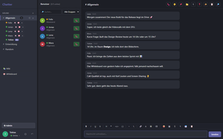</a> | **Chatter** | Teams-style workspace chat: rooms, DMs and group chats with threads and polls, a shared wiki and whiteboard, and video calls with screen sharing over a mediasoup SFU. Multi-workspace, with a database per workspace, roles and an audit log. `Electron` · `Node.js` · `Socket.IO` · `mediasoup` · `MongoDB` |
| <a href="assets/projects-full/deploynaut.png">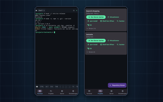</a> | **Deploynaut** | A full Linux dev environment on Android: Alpine or Ubuntu via proot, its own terminal emulator, GitHub cloning, a code editor with syntax highlighting, a Git UI, and dev servers that keep running in the background. `Kotlin` · `Jetpack Compose` · `proot` |
| <a href="assets/projects-full/hardkeys.png">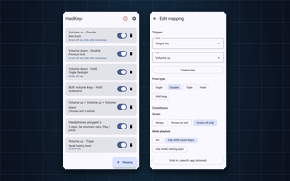</a> | **HardKeys** | Remaps Android hardware keys, **even with the screen off**, where accessibility-based apps go blind. It claims the volume keys through its own remote-volume MediaSession, so key presses are intercepted, not just observed. `Kotlin` · `Android` |
| <a href="assets/projects-full/calvista.png">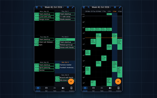</a> | **Calvista** | Calendar, mail, tasks, notes and contacts in one Android app, all linked to each other. Google, Microsoft and CalDAV/CardDAV accounts, IMAP push, widgets, voice entry, a Wear OS companion, eight languages. `Kotlin` · `Jetpack Compose` · `Wear OS` |
| <a href="assets/projects-full/drivelay.png">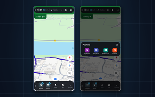</a> | **Drivelay** | Driving mode that replaces the retired "Android Auto for phones": Google Maps stays fullscreen, with draggable overlays for now playing, media keys, a dock of playlists and destinations, and a floating YouTube player on top. `Kotlin` · `Jetpack Compose` · `Android` |
| <a href="assets/projects-full/ar-measure.png">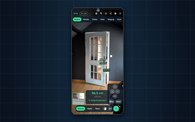</a> | **AR-Measure** | Measures real objects through the camera: distances, paths, areas and heights from a depth-averaged crosshair, plus an object mode that separates an item by depth and edges and returns W × H × D and volume. Uses LiDAR/ToF or depth estimation when the phone has it. `Kotlin` · `Jetpack Compose` · `ARCore` · `SceneView` |
| <a href="assets/projects-full/mediashare.png">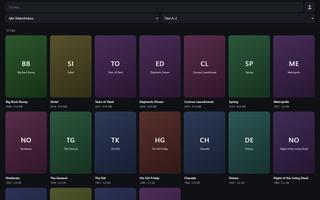</a> | **MediaShare** | Shares chosen folders from a Windows PC and serves a web UI for browsing and downloading your films and music on the phone, at home or on the road. Multi-user for family and friends, with per-library access. `.NET 9` · `ASP.NET Core` · `WinForms` |

---

### By the numbers.





